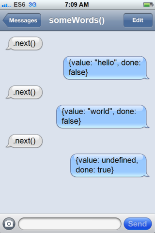
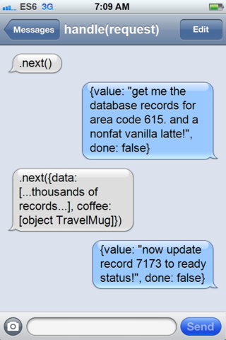

# 深度探索 ES6: 继续迭代器


深度探索 ES6 是一个针对 ECMAScript 标准中添加到 JavaScript 编程语言新功能的系列， 简称为 ES6。

欢迎回到深度探索 ES6 的课程!我希望在暑假中，你也像我一样，获得尽可能多的乐趣。但是，一个程序员的生活不可能全是烟花和柠檬水。现在是时候拿起我们放下的东西，同时，我已经找到完美的话题来重新开始了。

早在5月，我写了一篇关于生成器的博客。生成器是 ES6 的一种新功能。我称他们为 ES6 中最神奇的功能。我也谈到了生成器可能是异步编程的未来。然后我写了这段话：

>关于生成器，还有很多需要谈论的......但我认为这个博文的篇幅很长了，且现在够扑朔迷离了。像发生器本身，我们应该停下来，并采取了休息并另外找个时间继续。

现在就是适合的时间。

你可以在博客中找到对应文章的第一段就是上述的内容。在阅读这篇博文之前先复习一下前面的章节可能是最好的。继续，这是很有趣的。同时，这也是漫长且难懂的。但是，这是一只会说话的猫！

##快速滑稽剧
上一次，我们专注于生成器的基本行为。这是可能是有些奇怪的，但是也不难理解。生成器函数是很大程度上像一个普通函数。其主要区别在于，一个生成器函数的主体部分不是一次全部运行的。它每次都运行一小部分，每次遇到 yield 语句时就会暂停执行。

在上个关于生成器的博文的第1部分就已经详细解释了。但我们从来没有涉及到如何将所有的部分放在一起并工作的例子。现在，让我们一起来实现一下。

``` 
function* someWords() {
  yield "hello";
  yield "world";
}

for (var word of someWords()) {
  alert(word);
}
```

这段脚本足够的直接。但是如果你能够观察这里发生的一切的话，仿佛代码所有的不同位分别是一出戏中的人物，这将是一个相当不同的脚本。它可能是出现在这样的场景中：

场景 - 电脑内部，白天

FOR循环孤独地站在舞台上，戴着安全帽并背着一个剪贴板，这是所有的角色。

<center> FOR 循环
<center> ( 呼唤 )
<center> someWords( )!

 生成器出现了：一个身材高大，黄铜地，上发条的绅士。它看起来足够友好，但它仍然是一尊雕像。

<center> FOR 循环
<center> ( 呼唤 )
<center> ( 巧妙地拍着手 )
<center> 好吧！让我们做一些东西。
<center> ( 针对生成器 )
<center> .next( )!

生成器一下子就恢复地生机。
<center> 生成器
<center> ｛值：“你好”，是否已完成：否｝

其以一个愚蠢地姿势冻结住了。

<center> FOR 循环
<center> 警告！

立即进入警告状态，睁大眼睛并且气喘吁吁。我们感觉
他总是这样。

<center> FOR 循环
<center> 告诉用户“你好”。

警告转身并立即下了舞台。

<center> ALERT
<center> ( 从舞台上面下来并尖叫)
<center> 停止一切东西！
<center> 在 hacks.mozilla.org 的网页说，
<center> “你好”！

经过几秒钟的停顿，警告重新回来了，在走向 FOR 和 LOOP 的过程中的所有的路口都停下来。

<center> ALERT
<center> 用户说一切都正常。

<center> FOR 循环
<center> ( 巧妙地拍着手 )
<center> 好吧！让我们做完一些东西。
<center> ( 转过身回到生成器那边 )
<center> .next( )!

生成器又一次恢复生机。

<center> 生成器
<center> ｛值：“世界”，是否已完成：否｝

其用另一个愚蠢的姿势冻结住了。
<center> FOR 循环
<center> 警告！

<center> ALERT
<center> ( 已经在运行了 )
<center> 在上面了！
<center> ( 从舞台上面下来，尖叫 )
<center> 停止一切东西！
<center> 在 hacks.mozilla.org 的网页说，
<center> “世界”！

同样，一个暂停，然后 ALERT 吃力地跋涉回舞台，突然
垂头丧气。
<center> ALERT
<center> 用户再次说一切正常，但是...
<center> 但是请保护这个界面
<center> 免受创建其他对话的影响。

他退出了，撅着嘴。

<center> FOR 循环
<center> ( 巧妙地拍着手 )
<center> 好吧！让我们做完一些东西。
<center> ( 转过身回到生成器那边 )
<center> .next( )!

生成器第三次恢复生机。
<center> 生成器
<center> 带着尊严
<center> ｛值：未定义，是否已完成：是｝

它的头搁在其胸部，它眼睛里面的火熄灭了。它永远不会再移动了。
<center> FOR 循环
<center> 是我午餐的时间了。

她退出了舞台。

过了一会儿，垃圾收集器进入舞台，捡起毫无生气的生成器，然后离开了舞台。

好吧，这不完全是哈姆雷特。但是你得到了一个直观的感受。

正如你在舞台剧里面看到的，当一个生成器对象第一次出现的时候，他被暂停了。每次该对象的 .next( ) 方法被调用时，其苏醒过来并运行一会儿。

动作是同步的且是单线程。需要注意的是，这些角色中只有一个可以在任何给定的时间实际做任何东西。这些角色从不打断对方或与彼此谈论过。他们轮流发言，不管是谁在说话，只要他们想要的， 都可以继续发言。( 就像莎士比亚！）

同时这个剧的一些版本每次展开，生成器就被送入一个 for 循环。在你的代码中，.next( )方法的调用序列不会出现在任何地方。在这里，我把它全部放在了舞台上，但对于你和你的程序，这一切将发生在幕后，因为生成器和 for-of 循环是被设计利用迭代器接口一起工作。

所以总结一下到目前为止的知识点：
- 生成器对象是产生值的有礼貌的黄铜机器人。
- 每个机器人的程序由一个单一的代码块组成：即创建它的生成器函数体。

##如何关闭一个生成器
生成器有几个我在第1部分没有涵盖的几种繁琐的附加功能：
- generator.return( )
- generator.next( ) 的可选参数
- generator.throw(error)
- yield*

我跳过了以上这些，主要是因为若不理解这些功能存在的原因，是很难去关心到他们的，更别说让他们直直得留在你的脑袋里的。但是，随着我们更多地思考我们的程序将如何使用生成器，我们将看到原因。

这里就是你可能已经在一些情况下使用了的一种模式：
``` javascript
function doThings() {
  setup();
  try {
    // ... do some things ...
  } finally {
    cleanup();
  }
}

doThings();
```

清理可能涉及关闭连接或文件，释放系统资源，或者只是更新 DOM 来关闭一个“正在进行中”诱饵。我们希望这种事情发生于判断我们的工作是否成功完成，所以它会在一个 finally 块中出现。

在一个发生器中，这将是什么样子呢？
``` javascript
function* produceValues() {
  setup();
  try {
    // ... yield some values ...
  } finally {
    cleanup();
  }
}

for (var value of produceValues()) {
  work(value);
}
```

这看起来没事。但是，这里有一个微妙的问题：调用 work(value) 不是在 try 语句块里面。如果它抛出一个异常，对我们的清除步骤会有什么影响呢？

或者，假设这个 for 循环包含一个 break 或 return 语句。这对我们的清除步骤的影响又是什么呢？

反正它肯定会执行的。 ES6 有你的备份。

当我们第一次讨论迭代器和 for 循环的时候，我们说迭代器接口包含一个可选 .return( ) 方法。当迭代器说其已经完成工作前迭代退出的时候，语言自动调用这个方法。生成器也支持此方法。调用 myGenerator.return( ) 会导致生成器运行任何 finally 块，然后退出，就像当前的 yield 点已被神秘地变成了一个 return 语句。

需要注意的是，在所有上下文中 .return( ) 不是由语言自动调用的，仅在语言使用迭代协议的情况，语言会自动调用。因此，它有可能为作为生成器的不需要运行 finally 块的垃圾回收器。

这将如何在舞台上发挥功能的？该生成器在一个需要进行一些设置任务中被冻结，比如建设一个摩天大楼。突然有人抛出一个错误! for 循环将其捕获并把它放在一边。其 告诉生成器使用 .return( )。生成器平静地拆除其所有的脚手架并关闭。然后 for 循环采取错误备份，然后继续正常的异常处理。

##在负责中的生成器
到目前为止，我们已经看到了在生成器和其用户之间的对话已经是相当片面的了。以影院做比喻来打破：



用户在负责中。生成器按需进行工作。但是这不是使用生成器进行编程的唯一方法。

在第一部分中，我说过生成器可以被用于异步编程。你现在做的异步回调或承诺链接都可以用生成器来替代。你可能想知道究竟是如何工作的。为什么产生( yield )的能力是足够的（这毕竟是生成器的唯一的能力）？毕竟，异步代码并不仅仅用于产生。它使得东西发生。它要求从文件和数据库中的调用数据。其触发对服务器的请求。然后它返回到事件循环以等待那些异步进程完成。生成器究竟如何做到这一点的？如果没有回调，当数据来的时候，生成器怎样从这些文件，数据库和服务器接收数据的？

为了开始寻找答案，想像一下，如果我们只有一种方法使得 .next( ) 调用者传递值回生成器，这会导致什么事情发生。只需这一个变化，我们可以有一段全新的对话：




同时，一个生成器的 .next( ) 方法实际情况下确实有一个可选择的主题，且聪明的一点是，该说法随后出现为生成器的 yield 表达式的返回值。这就意味着，yield 不是类似于 return 的表达式；它是一种表达式，一旦生成器恢复，其就有一个值。

> var results = yield getDataAndLatte(request.areaCode);

这单一行代码做了很多的事情。
- 它调用了 getDataAndLatte( )。可以这样说，这个函数返回了一个字符串，即“get me the database records for area code...”这是我们在屏幕截图上面看到的。
- 其暂停了生成器，生成了一个字符串值。
- 在这点上，任何长度的时间都可能过去。
- 最终，某个人调用了 .next({data: ..., coffee: ...})。我们将该对象存储在局部变量 results 中并从下一行代码继续运行。

为了在上下文中说明，下面是上面显示的整个会话的代码：
``` javascript
function* handle(request) {
  var results = yield getDataAndLatte(request.areaCode);
  results.coffee.drink();
  var target = mostUrgentRecord(results.data);
  yield updateStatus(target.id, "ready");
}
```

现在如何 yield 仍只是意味着其之前的意思：暂停发生器和将值返回给调用者。但是，变化有多大！该生成器希望从它的调用者那里获取非常具体的支持。其似乎期望调用者可以表现得像一个行政助理一样。

普通函数通常不是这样的。他们的存在往往是为了满足他们的调用者的需求。但生成器是你可以与之有一个谈话的代码，这使得生成器和他们的调用者之间可能有更广泛的关系。

这个行政助理生成器运行者看起来是什么样子的呢？它并不必须如此的复杂。它看起来可能是这样的。
``` javascript
function runGeneratorOnce(g, result) {
  var status = g.next(result);
  if (status.done) {
    return;  // phew!
  }

  // The generator has asked us to fetch something and
  // call it back when we're done.
  doAsynchronousWorkIncludingEspressoMachineOperations(
    status.value,
    (error, nextResult) => runGeneratorOnce(g, nextResult));
}
```

为了使事情顺利进行，我们需要创建一个生成器并运行它，如下所示：
 >runGeneratorOnce(handle(request), undefined);

在五月份，我提到过 Q.async( )。其作为一个库的例子，其使用生成器作为异步的过程并且按需自动运行。runGeneratorOnce 就是这种东西。在实际使用中，生成器不会生成字符串拼写出他们需要调用者做的事情。他们可能会生成承诺的对象。

如果您已经了解的承诺，并且现在你了明白生成器，你可能想尝试修改 runGeneratorOnce 以支持承诺。这是一项困难的工作，但一旦你做了，你就使用的承诺作为直线代码，而不是现在看到的 .then( ) 方法或者回调的方法去编写异步算法了。


## 如何销毁一个生成器
你有没有注意到 runGeneratorOnce 是如何处理错误的？它忽略了他们！

嗯，这是不好的。我们真的想以某种方式将错误报告给生成器。同时，生成器也支持这一点：你可以调用 generator.throw(error)，而不是 generator.next(result)。这将导致 yield 表达式抛出。像 .return( )，生成器通常会被杀死，但如果目前的生成点是在 try 块中，那么 catch 和 finally 块是很荣幸的，因此生成器可能恢复。

修改 runGeneratorOnce 以确保 .throw( ) 被适当地调用是另一个很好的练习。请记住，生成器里面抛出的异常始终传播给调用者。所以 generator.throw(error) 将抛出错误给你除非生成器捕获它！

当生成器到达 yield 表达和暂停的时候，其完成了一系列的可能性，：

- 有人可能会调用 generator.next(value)。在这种情况下，生成器在其离开的地方继续执行。
- 有人可能会调用 generator.return()，可选地传递一个值。在这种情况下，不管它在做什么，生成器都不恢复。它值执行 finally 语句块。
- 有人可能会调用 generator.throw(error)。该生成器表现得好像 yield 表达式调用抛出错误的函数。
- 或者，也许没有人会做以上任何的东西。该生成器可能永远保持冻结。(是的，一个生成器进入一个 try 语句块并且从来没有执行 finally 语句块，这是可能的。在这个状态，一个生成器甚至可以被垃圾收集器回收。)


这没有比一个普通的旧函数的调用复杂很多。只是 .return() 确实是一个新的可能性。

事实上，yield 与函数调用有很多共同点。当你调用一个函数，你暂时停了下来，对不对？您调用的函数在控制。它可能返回。它可能会抛出。或者，它可能只是永远循环下去。


##生成器一起工作
让我再多展示一个功能。假设我们写了一个简单的生成器函数来连接两个可迭代的对象：
``` javascript
function* concat(iter1, iter2) {
  for (var value of iter1) {
    yield value;
  }
  for (var value of iter2) {
    yield value;
  }
}
```
ES6 为这个提供了一个速记本：
``` javascript
function* concat(iter1, iter2) {
  yield* iter1;
  yield* iter2;
}
```
一个普通的 yield 表达式生成一个值;一个 yield* 表达占用整个迭代器，并产生所有值。

相同的语法也解决了另一个有趣的问题：如何从一个发生器中调用一个生成器的问题。在普通的函数中，我们可以从一个函数铲起一堆代码，重构它使其变成一个单独的函数且不改变其行为。很显然，我们也要重构生成器。但是，我们需要一种方法来调用分解出的子程序，并确保我们之前得到的每个值仍产生，即使它现在是一个产生这些值的子程序。yield* 是做到这一点的方法。
``` javascript
function* factoredOutChunkOfCode() { ... }

function* refactoredFunction() {
  ...
  yield* factoredOutChunkOfCode();
  ...
}
```
请想想，一个黄铜机器人委派子任务到另一个机器人。你可以看到这种想法对编写大型生成器为基础的项目，并保持代码整洁有序的重要性了，就像函数是组织同步代码的关键。

##退场
嗯，这是它的生成器！我希望你像我一样非常的喜欢。回到生成器感觉非常好。

下周，我们将讨论另一个令人兴奋的功能。这是 ES6 的一种新的对象，其如此微妙，如此棘手，你最终可能会使用一种你甚至不知道它的存在的东西。请下周加入我们，让我们一起来看看 ES6 代理并进行深入探讨。